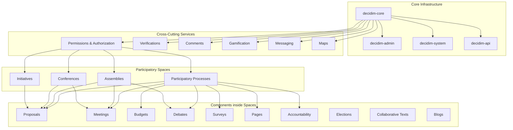
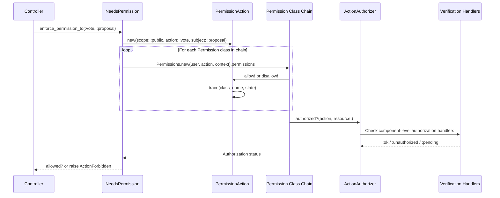
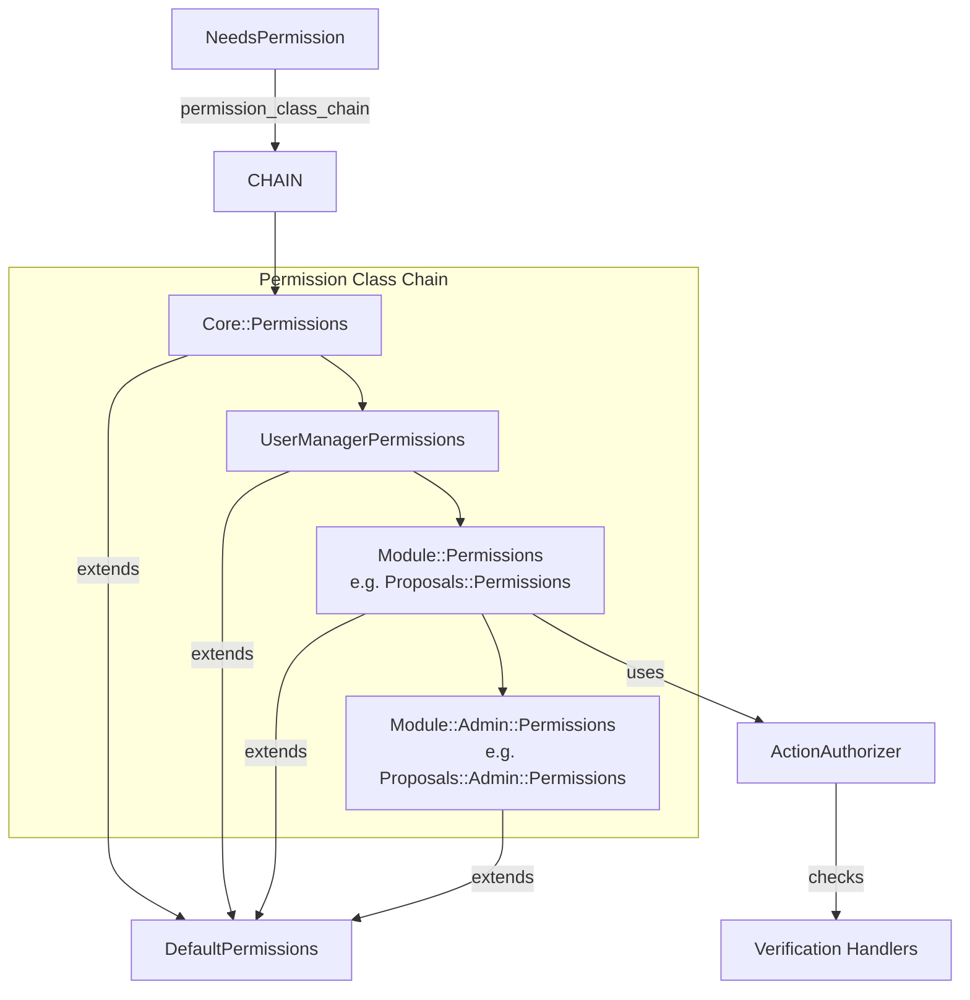
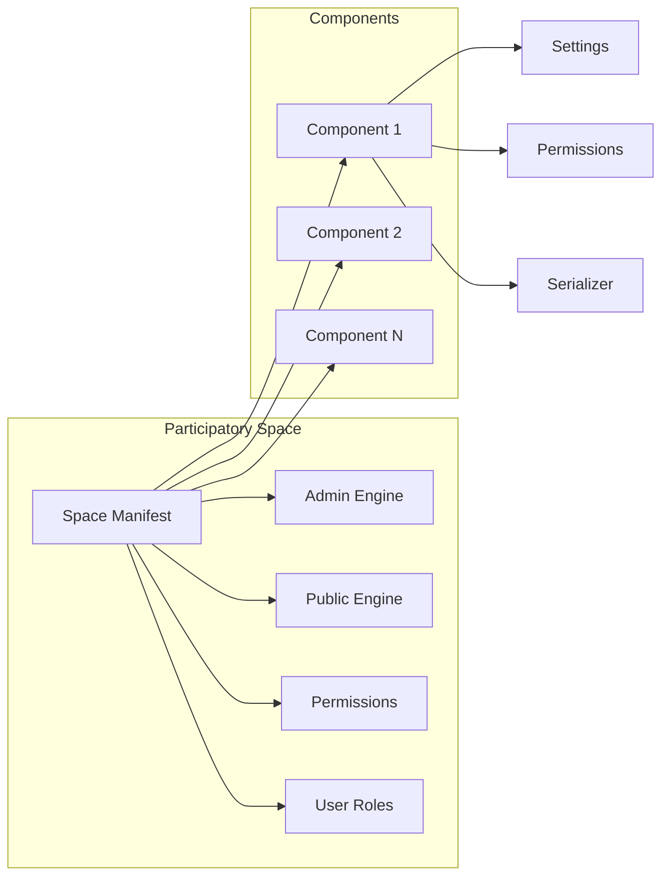
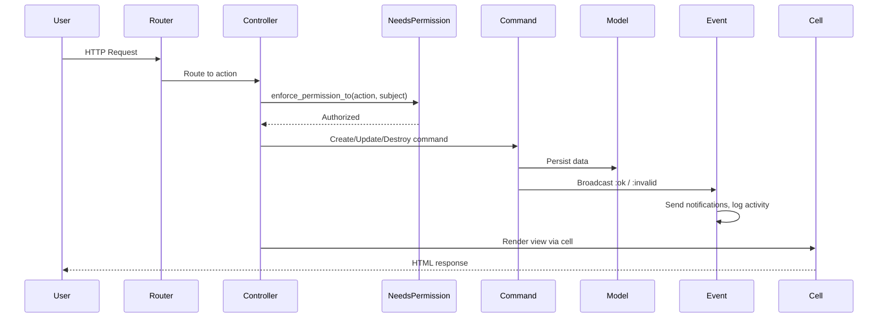

# Decidim Architecture

> Generated from the GitNexus knowledge graph — 10,909 files, 46,823 symbols, 93,235 relationships across the monorepo.

## Overview

Decidim is a Ruby on Rails participatory democracy framework shipped as a multi-gem monorepo. Each `decidim-*` directory is an independent gem that mounts into a host Rails application. The framework provides participatory spaces (processes, assemblies, conferences, initiatives) that contain components (proposals, meetings, budgets, debates, etc.) where citizens interact.

**Stack:** Ruby 3.4.7, Rails, PostgreSQL, Redis, Shakapacker (webpack), Capybara (system specs).

**Version:** 0.33.0.dev (AGPL-3.0-or-later)

## High-Level Architecture

## Functional Areas

Knowledge graph community detection identified 1,548 functional clusters. The top areas by symbol count:

| Functional Area | Symbols | Description |
|---|---|---|
| Admin | 1,720 | Admin dashboard, CRUD operations, component management, user moderation |
| Core (Decidim) | 1,291 | Base models, concerns, permissions engine, cells, forms, commands |
| Meetings | 128 | Meeting creation, registration, live events, minutes |
| Proposals | 117 | Proposal creation, endorsement, voting, collaborative drafting |
| Comments | 92 | Threaded commenting system with moderation |
| Initiatives | 83 | Citizen-initiated signatures and campaigns |
| Conferences | 68 | Conference management, speakers, registrations |
| Budgets | 64 | Participatory budgeting, project proposals, voting |
| Elections | 54 | Secure voting with trustee system |
| Verifications | 48 | Identity verification workflows (census, SMS, etc.) |
| System | 44 | Multi-tenant organization management |
| Debates | 40 | Structured debate forums |
| Forms | 35 | Dynamic form builder for surveys/questionnaires |
| Messaging | 32 | Private messaging between users |
| Surveys | 31 | Survey creation and response collection |
| Participatory Processes | 21 | Process lifecycle, phases, steps |
| Gamification | 14 | Badges, scores, progress tracking |
| API | 13 | GraphQL API layer |

## Permissions & Authorization Architecture

The permissions system is a chain-of-responsibility pattern where each module registers permission classes that are evaluated in sequence.

### Core Components

| Component | File | Role |
|---|---|---|
| **NeedsPermission** | `decidim-core/app/controllers/concerns/decidim/needs_permission.rb` | Controller concern providing `enforce_permission_to`, `allowed_to?`, `admin_allowed_to?`. Included in every ApplicationController across all modules. |
| **RegistersPermissions** | `decidim-core/app/controllers/concerns/decidim/registers_permissions.rb` | Allows modules to register permission classes into a global registry. |
| **PermissionAction** | `decidim-core/app/models/decidim/permission_action.rb` | Value object representing a permission check: `scope` (`:public`/`:admin`), `action`, `subject`. Three states: unset, allowed, disallowed. Includes tracing for debugging. |
| **DefaultPermissions** | `decidim-core/app/permissions/decidim/default_permissions.rb` | Base class for all permission classes. Convention-based: looks for `can_#{action}?` methods. Provides `toggle_allow`, `allow!`, `disallow!`, `authorized?` helpers. |
| **Permissions** (core) | `decidim-core/app/permissions/decidim/permissions.rb` | Core public permissions: reporting, reading pages, component actions, following, amending, messaging, notifications. |
| **ActionAuthorizer** | `decidim-core/app/services/decidim/action_authorizer.rb` | Checks component-level action permissions against verification/authorization handlers. |
| **UserRoleChecker** | `decidim-core/app/helpers/concerns/decidim/user_role_checker.rb` | Checks if a user has roles in any participatory space (processes, assemblies, conferences). |

### Permission Class Chain

Each module registers its own `Permissions` class. The chain is assembled per-controller and evaluated in order. If no class explicitly allows or disallows the action, the default is to deny.

### Module Permission Classes

Each gem registers permission classes at both public and admin scopes:

| Module | Public Permissions | Admin Permissions |
|---|---|---|
| decidim-core | `Permissions`, `UserManagerPermissions`, `ReportUserPermissions` | -- |
| decidim-accountability | `Accountability::Permissions` | `Accountability::Admin::Permissions` |
| decidim-admin | -- | `Admin::Permissions` |
| decidim-assemblies | `Assemblies::Permissions` | -- |
| decidim-budgets | `Budgets::Permissions` | `Budgets::Admin::Permissions` |
| decidim-collaborative-texts | `CollaborativeTexts::Permissions` | `CollaborativeTexts::Admin::Permissions` |
| decidim-comments | `Comments::Permissions` | -- |
| decidim-conferences | `Conferences::Permissions` | -- |
| decidim-debates | `Debates::Permissions` | `Debates::Admin::Permissions` |
| decidim-demographics | `Demographics::Permissions` | `Demographics::Admin::Permissions` |
| decidim-elections | `Elections::Permissions` | `Elections::Admin::Permissions` |
| decidim-initiatives | `Initiatives::Permissions` | `Initiatives::Admin::Permissions` |
| decidim-meetings | `Meetings::Permissions` | `Meetings::Admin::Permissions` |
| decidim-pages | `Pages::Permissions` | -- |
| decidim-participatory-processes | `ParticipatoryProcesses::Permissions` | -- |
| decidim-proposals | `Proposals::Permissions` | `Proposals::Admin::Permissions` |
| decidim-surveys | `Surveys::Permissions` | `Surveys::Admin::Permissions` |
| decidim-templates | -- | `Templates::Admin::Permissions` |

### Key Permission Execution Flows

The knowledge graph traced these top permission-related execution flows:

1. **Permissions -> Expired?** (6 steps): Core `Permissions.permissions` checks share token expiry for resource access.
2. **Permissions -> Trace** (5 steps): Module-specific permissions (conferences, assemblies, processes, initiatives, proposals) delegate through the trace mechanism for debugging.
3. **Permissions -> Has_authorship?** (5 steps): Initiative permissions verify user authorship before allowing edit/close actions.
4. **Permissions -> Onboarding_action** (4-5 steps): Core and space permissions check if an action is part of the onboarding flow.
5. **Permissions -> Conferences_with_role_privileges** (4 steps): Conference permissions check role-based access (admin, moderator, collaborator).

## Key Architectural Patterns

### Command Pattern
Each `commands/` directory contains command objects (Create/Update/Destroy) that broadcast events (`:ok`, `:invalid`). Controllers delegate business logic to commands.

### Form Objects
Forms (`forms/`) use `Decidim::Attributes` for type coercion. They are separate from ActiveRecord models and handle input validation.

### Cells (View Components)
Views use Trailblazer::Cells (`cells/` directory) for encapsulated UI components. Each cell has its own view template and logic.

### Query Objects
Custom query classes (`queries/`) encapsulate complex database queries. They follow a base class pattern with chainable scopes.

### Event System
`events/` contains notification and activity logging classes. Types include `SimpleEvent`, `NotificationEvent`, and `EmailEvent` for different delivery channels.

### Participatory Space Pattern
Participatory spaces (processes, assemblies, conferences, initiatives) follow a common pattern:
- A manifest declares the space's capabilities
- Spaces contain components
- Spaces have admin and public controllers
- Spaces have their own permissions class
- Spaces can have user roles (admin, moderator, collaborator)

## Data Flow: Request Lifecycle

## Module Dependency Graph

```mermaid
graph TD
    CORE[decidim-core] --> ADMIN[decidim-admin]
    CORE --> SYSTEM[decidim-system]
    CORE --> API[decidim-api]
    CORE --> DEV[decidim-dev]
    CORE --> VER[decidim-verifications]

    ADMIN --> ACC[decidim-accountability]
    ADMIN --> BUD[decidim-budgets]
    ADMIN --> COMTXT[decidim-collaborative-texts]
    ADMIN --> DEB[decidim-debates]
    ADMIN --> DEM[decidim-demographics]
    ADMIN --> ELE[decidim-elections]
    ADMIN --> MEET[decidim-meetings]
    ADMIN --> PAGES[decidim-pages]
    ADMIN --> PROP[decidim-proposals]
    ADMIN --> SURV[decidim-surveys]
    ADMIN --> TMPL[decidim-templates]

    CORE --> ASM[decidim-assemblies]
    CORE --> BLOG[decidim-blogs]
    CORE --> CMT[decidim-comments]
    CORE --> CONF[decidim-conferences]
    CORE --> GAM[decidim-gamification]
    CORE --> INIT[decidim-initiatives]
    CORE --> MAP[decidim-maps]
    CORE --> PP[decidim-participatory-processes]

    PROP --> COMTXT
    PP --> PROP
    PP --> MEET
    ASM --> PROP
    ASM --> MEET
    CONF --> MEET
    INIT --> PROP

    CMT --> ACC
    CMT --> BUD
    CMT --> DEB
    CMT --> MEET
    CMT --> PROP

    VER --> DEM
```

## Statistics

| Metric | Value |
|---|---|
| Total files indexed | 10,909 |
| Total symbols | 46,823 |
| Total relationships | 93,235 |
| Functional clusters | 1,548 |
| Execution flows traced | 300 |
| Permission class files | 30 |
| Modules (gems) | 24 |
